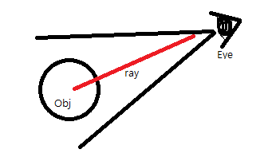

### raycast란?


카메라 시점에서 어떤 점을 향하여 선을 그었을 때 선의 경로에 object가 있는지 없는지를 확인한다. 

## raycast를 이용하여 마우스 클릭할 때 object 이동하기

필드에 놓여있는 오브젝트를 필드 위의 어떤 점으로 이동시키는 것을 구현하였다.

### 카메라 시점에서 raycast 실행하기

raycast는 카메라를 기준으로 ray를 쏘는 것이므로 클래스에서 카메라 component를 불러와야 한다. 그래서 카메라 오브젝트에 사용될 스크립트를 썼다. 

오브젝트를 이동시키는 스크립트는 따로 썼다.

``` javascript


import { _decorator, Component, systemEvent, SystemEventType, EventKeyboard, Vec3, AudioSource, AudioClip, Collider, ITriggerEvent } from 'cc';
const { ccclass, property } = _decorator;

// raycast 경로에 오브젝트를 통과하는 점의 좌표들
export let rayRes: Array<object> = null!
// 경로와 필드가 마주하는 x, z의 좌표
export let rayPosX: number = null!;
export let rayPosZ: number = null!;
// raycast를 쏘았을 때 경로상에 오브젝트가 있는지
export let isRay: boolean = null!;

@ccclass('Camera')
export class Camera extends Component {

    // 카메라 component를 불러와준다
    @property({ type: CameraComponent })
    private camera: CameraComponent = null as any;

    // ray를 불러옴
    private _ray: geometry.Ray = new geometry.Ray();
    

    start () {        
      systemEvent.on(SystemEventType.MOUSE_DOWN, this.onMouseDown, this);
    }

    onMouseDown(e: EventMouse) {        
        this.camera = this.getComponent(CameraComponent)
        
        // 카메라의 시점에서 raycast를 실행함. raycast가 실행되는 x, y 좌표를 지정함
        this.camera.screenPointToRay(e.getLocationX(), e.getLocationY(), this._ray);
        // raycast의 거리를 정할 수 있음. 
        isRay = PhysicsSystem.instance.raycast(this._ray, 0xffffffff, 100, true);
        rayRes = PhysicsSystem.instance.raycastResults;
        rayPosX = PhysicsSystem.instance.raycastResults[0].hitPoint.x;
        rayPosZ = PhysicsSystem.instance.raycastResults[0].hitPoint.z;
        console.log('raycast get', isRay)
        console.log(rayRes)
    }

}

```

### 오브젝트 스크립트에서 raycast불러와 이동하기

마우스를 클릭하면 오브젝트를 클릭한 지점으로 이동시키는 스크립트를 짰다. 카메라 스크립트에서 raycast의 결과 값을 불러와 결과 값의 x, y 좌표를 향해 오브젝트가 이동한다.

마우스를 클릭했을 때 목표지점까지 얼마만큼 이동해야 할지를 계산한다. 오브젝트의 현재 좌표와 raycast가 실행된 목표지점으로 이동해야할 거리를 삼각함수를 이용해 계산한다. 

오브젝트는 델타 타임마다 일정거리를 이동한다. 오브젝트의 현재 좌표에서 목표지점으로 한번에 이동하는 것이 아니기 때문에 델타 타임 동안 어느 정도의 거리를 이동할지를 계산한다.

``` javascript

import { _decorator, Component, systemEvent, SystemEventType, Vec3, EventMouse } from 'cc';

// 카메라 스크립트에서 raycast 값을 불러와주었다
import { isRay, rayPosX, rayPosZ } from './Camera'
const { ccclass, property } = _decorator;
 
@ccclass('MousePlayer')
export class MousePlayer extends Component {

    private _curPos = new Vec3();
    // 델타 타임마다 이동해야할 횟수
    private c1val: number = 0;
    // x의 이동값
    private x1val: number = 0;
    // z의 이동값
    private z1val: number = 0;

    start () {        
        systemEvent.on(SystemEventType.MOUSE_DOWN, this.onMouseDown, this);
    }

    onMouseDown() {     
        // raycast가 실행되었는지 확인한다
        if (isRay) {
            let curx, curz, xLen, zLen, cval, dt, moveLen;
            // 오브젝트의 현재 좌표 x, z
            curx = this.node.getPosition().x;
            curz = this.node.getPosition().z;
            // 델타 타임
            dt = 0.015;
            // 횟수당 이동하는 길이
            moveLen = 3;
            console.log('cur x, z', curx, curz)
            console.log('ray x, z', rayPosX, rayPosZ)
            // raycast된 좌표까지의 x, z의 길이
            xLen = curx - rayPosX;
            zLen = curz - rayPosZ;
            // 삼각함수에 의한 좌표까지의 대각선 길이
            cval = Math.sqrt(Math.pow(xLen, 2) + Math.pow(zLen, 2));
            // 대각선 길이에서 이동해야 할 횟수
            this.c1val = cval/(dt * moveLen);
            // 오브젝트를 이동할 때 x, z 값
            this.x1val = - xLen / this.c1val;
            this.z1val = - zLen / this.c1val;
            console.log(this.x1val, this.z1val)
           }
    }

    moveObj(x: number, y: number, z: number) {                 
        this.node.getPosition(this._curPos)
        Vec3.add(this._curPos, this._curPos, new Vec3(x, y, z));        
        this.node.setPosition(this._curPos);
    }

    update(dt: number) {    
        // 목표 지점에 도착했는지 확인        
        if(this.c1val > 0) {
            // 오브젝트 이동
            this.moveObj(this.x1val, 0, this.z1val)    
            // 이동해야할 횟수에서 1만큼 뺌
            this.c1val = this.c1val - 1;
        }else if(this.c1val === 0) {

        }       
        
    }
}

```

[삼각함수 구하기](./raycast-move.png)

object는 delta time 동안 x, z 만큼의 거리를 이동한다. 현재 오브젝트의 좌표에서 목표 좌표까지의 거리를 삼각함수로 구해주고 이를 델타 시간과, 이동할 거리 만큼 나누어 x, z가 이동해야 할 횟수를 정해주어야 한다. 